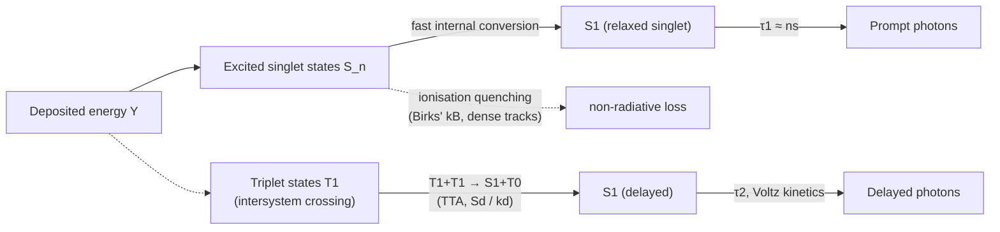
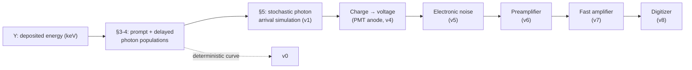

# scintiPulses — Photophysics Model

This document describes the physics behind the light-emission model implemented in
[`scintiPulses.py`](../scintipulses/scintiPulses.py): how a deposited energy is turned into a
population of prompt and delayed scintillation photons, and how that population is converted
into a simulated detector pulse. It covers both the deterministic ("theoretical") illumination
function `v0` and the stochastic ("quantum", shot-noise) illumination function `v1`.

For the parameter list and the rest of the signal chain (PMT, preamplifier, shaper, digitizer),
see the main [README](../README.md).

-----

## 1. Overview

A single interaction deposits an energy $Y$ (keV) in the scintillator. This energy excites a
population of molecules to singlet ($S_n$) and triplet ($T_1$) states, which decay through two
physically distinct channels:



Two *independent* saturating mechanisms act along the particle track, both controlled by the
local stopping power $dE/dx$, but affecting different channels:

| Mechanism | Parameter(s) | Channel affected | Physical origin |
| :--- | :--- | :--- | :--- |
| Birks ionisation quenching | `kB` | **Prompt** only | Non-radiative $S_n \to S_1$ internal conversion, enhanced at high ionisation density |
| Triplet-triplet annihilation (TTA) | `Sd`, `kd` | **Delayed** only | Saturating build-up of the local triplet population, later recombining as $T_1+T_1\to S_1+T_0$ |

These two mechanisms are **not** the same process and do not feed one another: quenched
prompt-channel energy is simply lost (as heat), it does not become delayed light. This is why
`scintiPulses` exposes them as two separate models with two separate parameter sets, rather than
coupling the delayed yield to the Birks-quenched energy.

-----

## 2. Electron stopping power model

Both saturating mechanisms above need a local ionisation-density proxy, $dE/dx(E)$, as a function
of the electron's residual energy $E$. `scintiPulses` implements this itself
(`stopping_power_electron`, no runtime dependency on external stopping-power libraries), using
two regimes:

**Relativistic Bethe formula** (valid for $E \ge 20$ keV):

$$
\left(\frac{dE}{dx}\right)_{\text{Bethe}} = \rho\left[\frac{0.1535}{\beta^2}\frac{Z}{A}\left(B_0 - 2\ln\frac{I}{m_ec^2}\right) + a_{hc}^2\,\frac{N_A Z^2 \rho\,(E+m_ec^2)}{137\,(m_ec^2)^2 A}\left(4\ln 2\gamma - \frac{4}{3}\right)\right]
$$

with $\gamma = (E+m_ec^2)/m_ec^2$, $\beta^2 = 1-1/\gamma^2$, $\tau = E/m_ec^2$, and

$$
B_0 = \ln\!\left(\frac{\tau^2(\tau+2)}{2}\right) + \frac{1+\tau^2/8-(2\tau+1)\ln 2}{(\tau+1)^2}
$$

**Joy-Luo (1989) low-energy modification** (valid below 20 keV, where Bethe's formula
diverges):

$$
\left(\frac{dE}{dx}\right)_{\text{Joy-Luo}} = \frac{0.1535}{\beta^2}\frac{Z}{A}\,\ln\!\left(\frac{1.166\,(E+kI)}{I}\right)\rho \times 1.982, \qquad k=0.85
$$

Default medium parameters (organic liquid-scintillator-like): density $\rho=0.98$ g/cm³, mean
ionisation potential $I=64.7$ eV, effective atomic number $Z=3.252$, effective mass number
$A=5.945$.

The figure below sketches the resulting curve: $dE/dx$ rises steeply as the electron slows down
(Bragg-peak-like behaviour), which is what drives *both* saturating mechanisms below.

```
 dE/dx
   ^
   |                                              *
   |                                         *
   |                                   *
   |                             *
   |                     *
   |            *  *
   |     *  *
   | *
   +---------------------------------------------------> E (residual energy)
   0                    20 keV (Bethe/Joy-Luo switch)
```

-----

## 3. Prompt fluorescence and Birks quenching

At high ionisation density, some fraction of the $S_n$ population relaxes non-radiatively
instead of feeding $S_1$ (Birks' law of ionisation quenching, J.B. Birks, *The Theory and
Practice of Scintillation Counting*, 1964). Integrated along the track, the **quenched
(light-producing) energy** is:

$$
E_q(Y) = \int_0^{Y} \frac{dE}{1 + k_B \left(\dfrac{dE}{dx}\right)(E)}
$$

implemented as `birks_quenched_energy(Y, kB, nE)` (numerical trapezoidal integration over `nE`
points). $k_B$ is the Birks constant in cm/MeV; typical organic-scintillator values are in the
range $0.006$–$0.015$ cm/MeV (default `kB=0.01`).

The mean number of **prompt** photons for an event of energy $Y$ is then

$$
N_{ph}^{\text{prompt}} =
\begin{cases}
L \cdot E_q(Y) & \text{if quenching=True} \\
L \cdot Y & \text{if quenching=False}
\end{cases}
$$

where $L$ is the scintillator light yield (photons/keV). Quenching only ever *reduces* the
prompt yield — it never adds photons anywhere else.

-----

## 4. Delayed fluorescence

Two interchangeable models are available, selected by the `TTA` flag.

### 4.1 TTA saturating model (`TTA=True`, default)

The delayed channel is fed by triplet states produced along the track. At high ionisation
density the local triplet population saturates (triplets start interacting with each other
before they can separate), so the *rate* at which useful TTA precursors are produced per unit
energy loss saturates too — exactly the same mathematical shape as Birks' law, but with its own,
independent efficiency and saturation parameters:

$$
\mu_{\text{delayed}}(Y) = \int_0^{Y} \frac{S_d \left(\dfrac{dE}{dx}\right)(E)}{1 + k_d \left(\dfrac{dE}{dx}\right)(E)}\, dE
$$

implemented as `tta_delayed_yield(Y, Sd, kd, nE)`. $S_d$ is the TTA efficiency factor (delayed
photons per keV in the low-$dE/dx$ limit, default `Sd=0.005`), and $k_d$ is the saturation
constant of the triplet interaction density in cm/MeV (default `kd=0.01`). The mean number of
delayed photons is then simply

$$
N_{ph}^{\text{delayed}} = \mu_{\text{delayed}}(Y)
$$

Because $\mu_{\text{delayed}}$ grows with the *local* stopping power rather than with the total
deposited energy, densely-ionising particles (e.g. alphas) produce proportionally *more* delayed
light than sparsely-ionising ones (e.g. betas) at the same total energy — the qualitative
behaviour used for pulse-shape discrimination in real detectors.

### 4.2 Legacy simple model (`TTA=False`)

For backward compatibility, or when a minimal model is preferred, the delayed yield can instead
be a fixed fraction of the prompt yield:

$$
N_{ph}^{\text{delayed}} = p_2 \cdot N_{ph}^{\text{prompt}}
$$

### 4.3 Kinetics: exponential vs. Voltz bimolecular

The *time shape* of the delayed emission is tied to the same `TTA` flag:

- **`TTA=False`**: plain exponential decay, time constant $\tau_2$ — the classic "double
  exponential" pulse model (prompt + delayed, both exponential):

$$
f_{\text{delayed}}(t) = \frac{1}{\tau_2}\,e^{-t/\tau_2}
$$

- **`TTA=True`**: Voltz bimolecular (second-order, diffusion-free) kinetics. Under pure
  triplet-triplet annihilation, $d[T]/dt = -k_2[T]^2$, which integrates to

$$
[T](t) = \frac{T_0}{1+t/\tau_2}, \qquad \tau_2 = \frac{1}{k_2 T_0}
$$

  Since each TTA event consumes two triplets to emit one delayed photon, the emission rate is
  $\propto [T](t)^2$, giving the normalized shape actually used in the code:

$$
f_{\text{delayed}}(t) = \frac{1}{\tau_2}\left(1+\frac{t}{\tau_2}\right)^{-2}, \qquad \int_0^\infty f_{\text{delayed}}(t)\,dt = 1
$$

This is a heavier-tailed, non-exponential decay (a power law at long times instead of a fast
exponential cutoff) — the correct qualitative behaviour of TTA-driven delayed fluorescence, and
noticeably different from a simple exponential at $t \gtrsim \tau_2$:

```
 intensity (log scale)
   ^
   |  \
   |   \___                         exponential  e^(-t/τ2)
   |       \‾‾--__
   |        \      ‾‾--__
   |         \            ‾‾--__
   |          \.                  ‾‾--__
   |            ' .                       ‾‾--__          Voltz  (1+t/τ2)^-2
   |               ' - .  _                        ‾‾--__
   |                      ' - . _ _                       ‾‾--
   +------------------------------------------------------------> t
   0        τ2        2τ2        5τ2       10τ2
```

The full event illumination function combines both channels:

$$
g(t) = \frac{N_{ph}^{\text{prompt}}}{\tau_1}\,e^{-t/\tau_1} \;+\; N_{ph}^{\text{delayed}} \cdot f_{\text{delayed}}(t)
$$

which is what the deterministic output `v0` accumulates (summed over all events, each shifted to
its arrival time and renormalized so its discrete-time integral equals
$N_{ph}^{\text{prompt}}+N_{ph}^{\text{delayed}}$ exactly, within the simulated time window).

-----

## 5. From continuous rates to discrete stochastic photon counts

The deterministic curve $g(t)$ above gives the *expected* photon rate. The stochastic
("quantum illumination", shot-noise) output `v1` instead simulates the actual discrete photon
arrivals, event by event, via a two-step procedure common to both channels:

1. **Draw the total number of excited states** for the channel (prompt or delayed), from the
   mean computed in Sections 3–4:
   - Fano factor $F=1$ (default): Poisson statistics, $n_s \sim \text{Poisson}(\mu)$.
   - $F \ne 1$: sub/super-Poissonian statistics via a normal distribution truncated at zero,
     $n_s \sim \mathcal N(\mu, F\mu)\big|_{n_s\ge 0}$, then rounded to the nearest non-negative
     integer (needed so that the depletion loop below can reach *exactly* zero).

2. **Deplete that population bin-by-bin** at the sampling rate, using a *hazard function*
   $h(t,\Delta t)$ giving the probability that a remaining excited state transitions to a photon
   during the interval $[t,t+\Delta t)$:

$$
n_p(t) \sim \text{Binomial}\big(n_s(t),\, h(t,\Delta t)\big), \qquad n_s(t+\Delta t) = n_s(t) - n_p(t)
$$

   The photons produced in each interval are then shared across `nChannel` detectors
   (`Multinomial`) and thinned once more by the photon-to-charge quantum efficiency `rendQ`
   (`Binomial`) to give the detected charge.

The hazard function is obtained analytically from the survival function $S(t)=\int_t^\infty
f(t')\,dt'$ of the corresponding continuous kinetics, $h(t,\Delta t) = 1 - S(t+\Delta t)/S(t)$:

| Channel | Kinetics | Survival $S(t)$ | Hazard $h(t,\Delta t)$ |
| :--- | :--- | :--- | :--- |
| Prompt | exponential, $\tau_1$ | $e^{-t/\tau_1}$ | $1-e^{-\Delta t/\tau_1}$ (constant) |
| Delayed, `TTA=False` | exponential, $\tau_2$ | $e^{-t/\tau_2}$ | $1-e^{-\Delta t/\tau_2}$ (constant) |
| Delayed, `TTA=True` | Voltz, $\tau_2$ | $(1+t/\tau_2)^{-1}$ | $1-\dfrac{\tau_2+t}{\tau_2+t+\Delta t}$ (time-varying) |

The prompt channel and the legacy exponential delayed channel are memoryless, so their hazard is
a single constant computed once per call. The TTA delayed channel is **not** memoryless — its
hazard grows smaller as $t$ increases (the surviving triplet population is thinning out and
becoming less likely to react per unit time), so it is recomputed at every simulated time step.

This binomial-thinning construction reproduces the continuous kinetics *exactly* in expectation
over many repetitions — it is the discrete-time equivalent of sampling from the corresponding
inhomogeneous Poisson process.

-----

## 6. Where this fits in the full signal chain

The photon populations derived above are only the first stage of the full simulation. The rest
of the chain (charge conversion, PMT anode, electronic noise, preamplifier, shaper, digitizer) is
documented in the main [README](../README.md); the diagram below places this document's scope in
context.



-----

## 7. Symbol summary

| Symbol | Code name | Meaning | Units |
| :--- | :--- | :--- | :--- |
| $Y$ | `Y` | Deposited energy per event | keV |
| $L$ | `L` | Scintillation light yield | photons/keV |
| $dE/dx$ | `stopping_power_electron` | Electron stopping power | MeV/cm |
| $k_B$ | `kB` | Birks constant (prompt quenching) | cm/MeV |
| $E_q$ | `birks_quenched_energy` | Birks-quenched (light-producing) energy | keV |
| $S_d$ | `Sd` | TTA efficiency factor | photons/keV (low $dE/dx$ limit) |
| $k_d$ | `kd` | TTA saturation constant | cm/MeV |
| $\mu_{\text{delayed}}$ | `tta_delayed_yield` | Mean number of delayed (TTA) photons | photons |
| $\tau_1$ | `tau1` | Prompt decay time | s |
| $\tau_2$ | `tau2` | Delayed characteristic time | s |
| $p_2$ | `p2` | Legacy delayed fraction (`TTA=False` only) | — |
| $F$ | `F` | Fano factor | — |

-----

## 8. References

- J.B. Birks, *The Theory and Practice of Scintillation Counting*, Pergamon Press, 1964.
- R. Voltz *et al.*, on the bimolecular (triplet-triplet annihilation) origin of delayed
  fluorescence kinetics in organic scintillators.
- D.C. Joy, S. Luo, "An empirical stopping power relationship for low-energy electrons",
  *Scanning* 11, 176–180 (1989).
- ASTAR/ESTAR (NIST), stopping-power reference data: https://dx.doi.org/10.18434/T4NC7P
